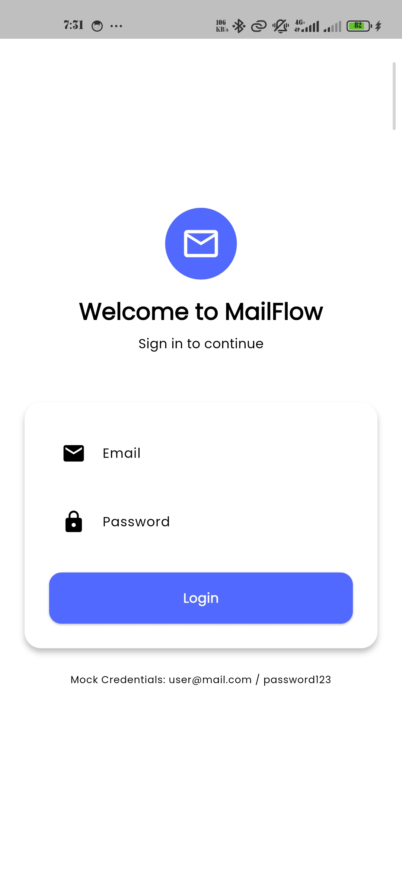
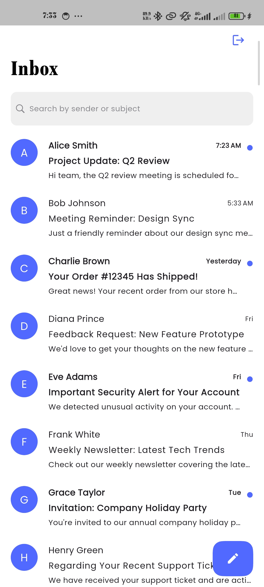
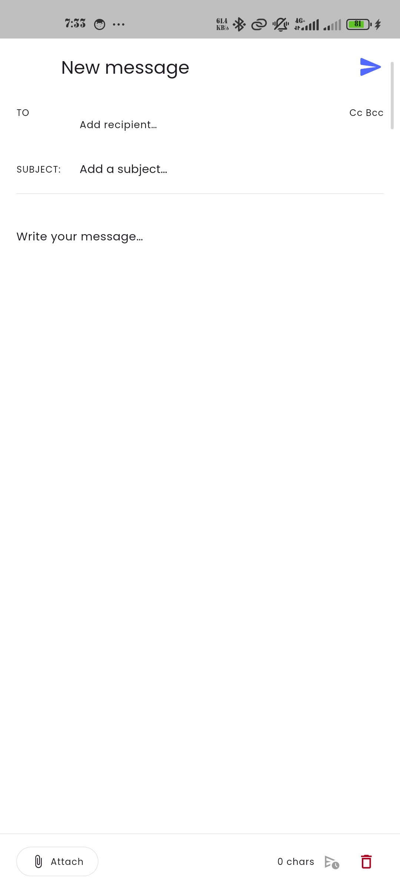
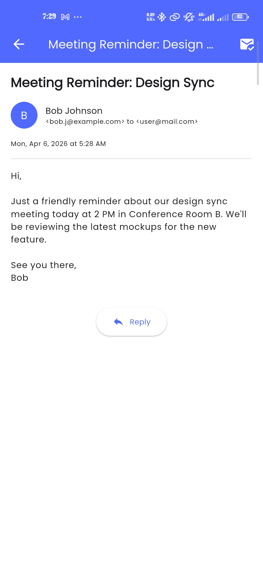
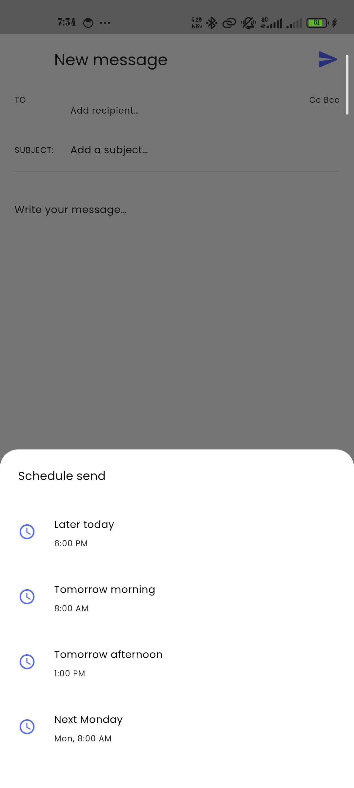
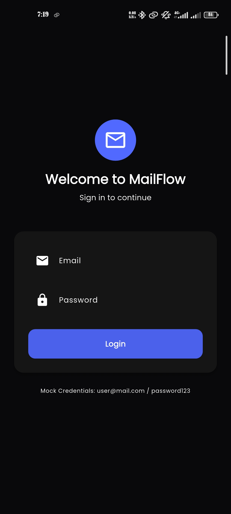
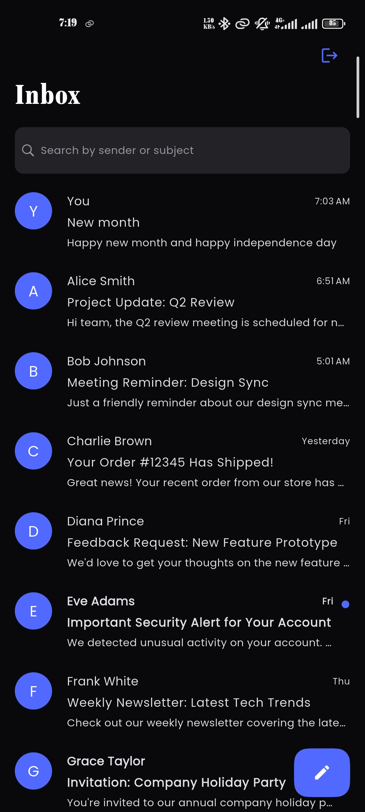
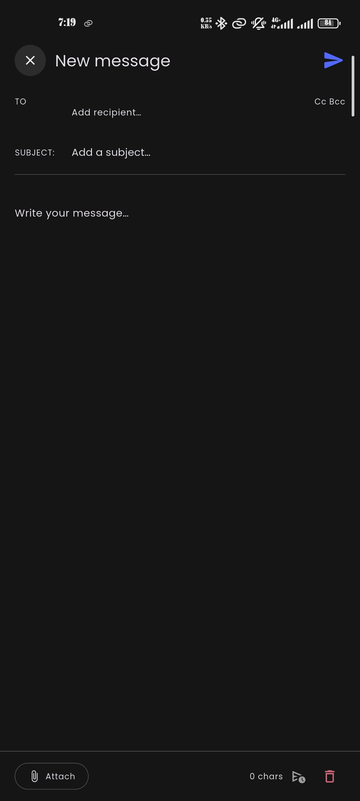
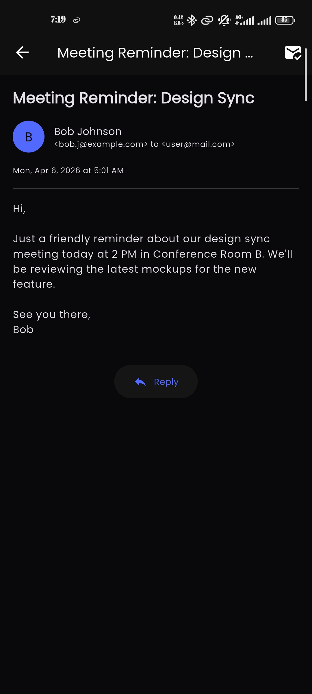
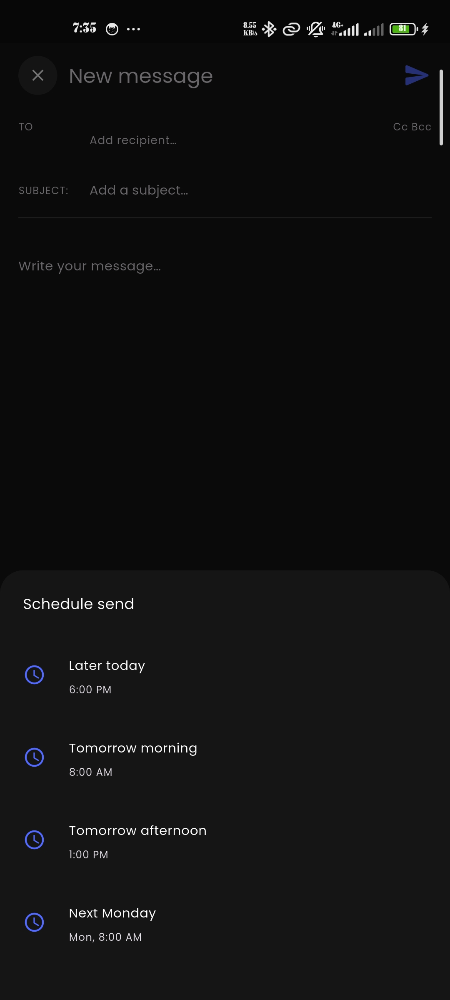

# MailFlow — Flutter Email Client

GitHub Repository:
- `https://github.com/TheNairaSign/Mail-flow.git`

## How to Run
1. Clone the repo: `git clone <url>` (Replace `<url>` with the actual repository URL)
2. Run `flutter pub get`
3. Run `flutter run`

## Mock Credentials
- Email: `user@mail.com`
- Password: `password123`

## Architecture
Clean Architecture with Riverpod state management, GoRouter for navigation, and Material 3 design system. The project is structured into Data, Domain, and Presentation layers.

## Challenges Faced
- **State Management Complexity:** Coordinating Riverpod providers across multiple screens (auth, inbox, compose, detail) while keeping state consistent and avoiding unnecessary rebuilds required careful provider scoping and `ConsumerStatefulWidget` usage.
- **Navigation & Routing:** Implementing conditional routing based on authentication state using `onGenerateRoute` instead of a dedicated router like GoRouter meant manually handling redirect logic and ensuring proper back-stack behavior.
- **Theme Consistency:** Maintaining a unified Material 3 design system across light and dark modes while avoiding hardcoded colors required migrating legacy `AppColors` tokens to `Theme.of(context).colorScheme` throughout the codebase.
- **Widget Decomposition:** Breaking the compose email screen into small, reusable widgets (`ComposeTopBar`, `ComposeRecipientsField`, `ComposeBottomBar`, etc.) without excessive prop-drilling required thoughtful callback and model design.
- **Custom Gesture Handling:** Integrating `universal_back_gesture` with `ZoomPageTransitionsBuilder` required tuning animation thresholds to avoid conflicts with native iOS/Android swipe-back gestures.
- **Mock Data Strategy:** Simulating realistic email flows (recipients, attachments, quoted replies) without a backend meant designing flexible data models and placeholder content that still exercises the full UI.
- **Form & Input Handling:** Building a recipient chip system with add/remove, Cc/Bcc toggling, and subject/body fields required careful `TextEditingController` lifecycle management and keyboard-aware layouts.

## Screenshots

### Light Mode
| Login | Inbox | Compose |
|-------|-------|---------|
|  |  |  |

| Email Detail | Schedule Send |
|-------------|---------------|
|  |  |

### Dark Mode
| Login | Inbox | Compose |
|-------|-------|---------|
|  |  |  |

| Email Detail | Schedule Send |
|-------------|---------------|
|  |  |

